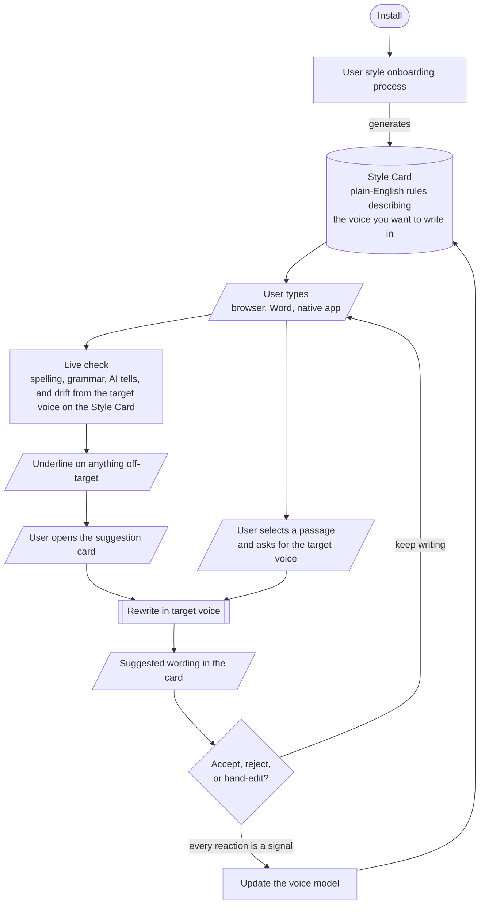
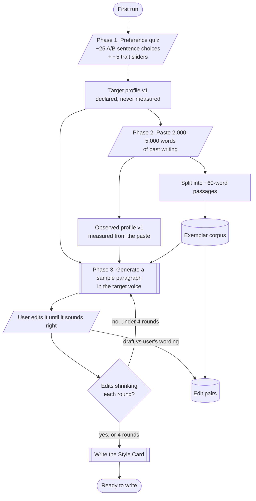
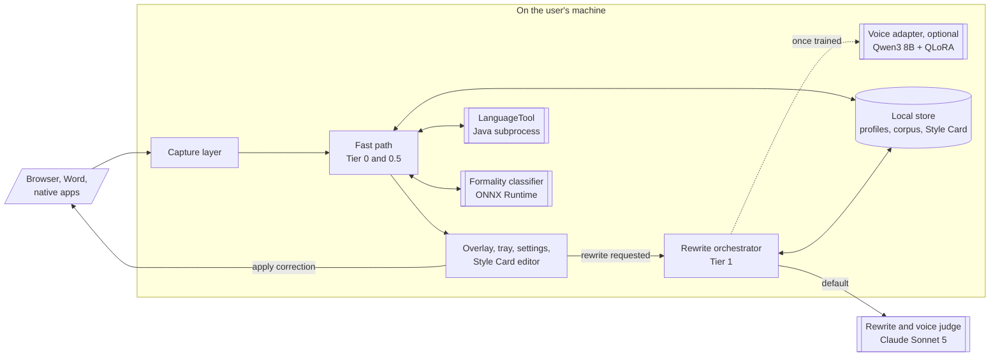
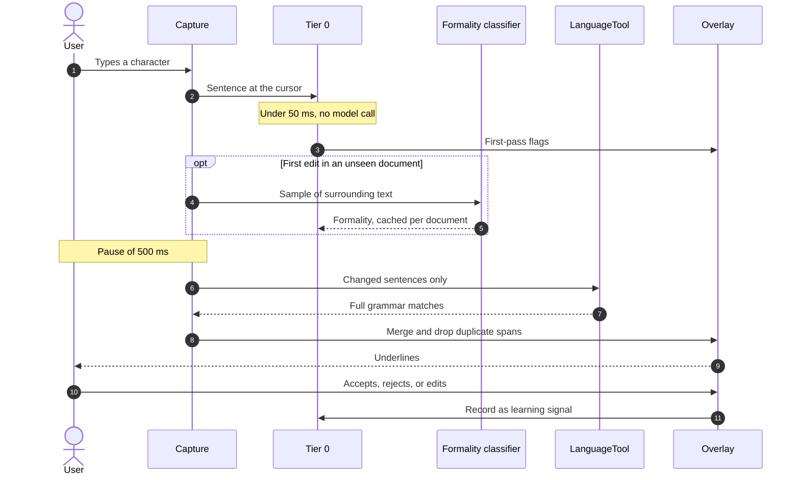
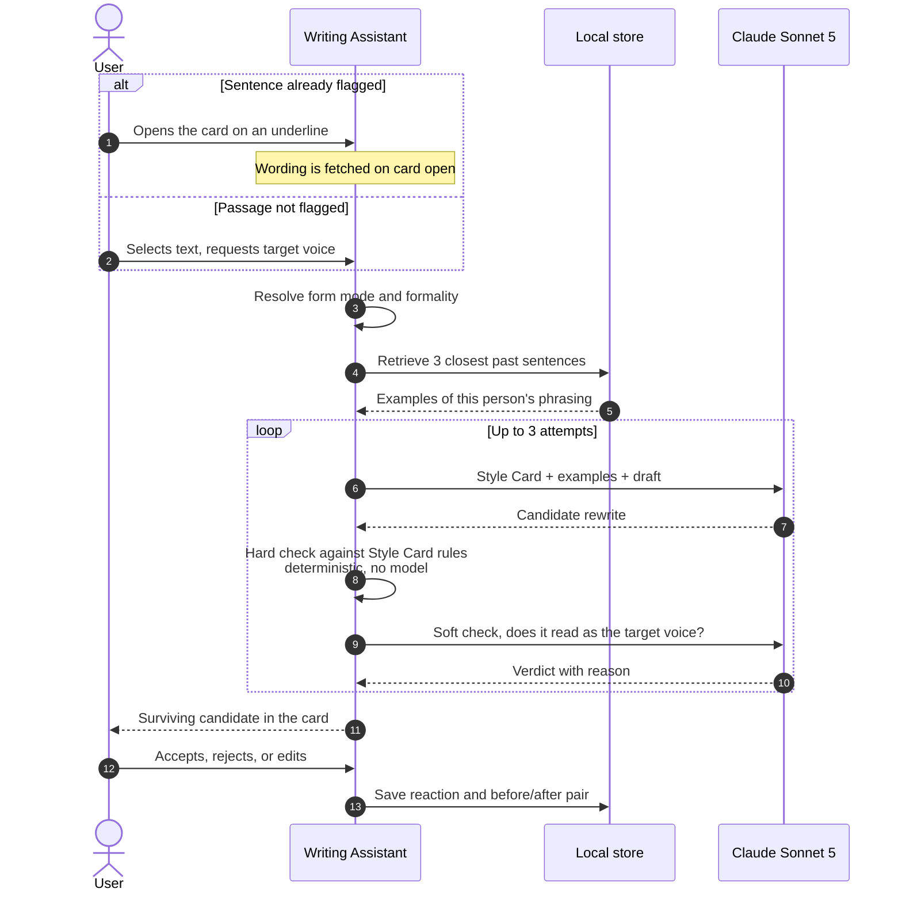
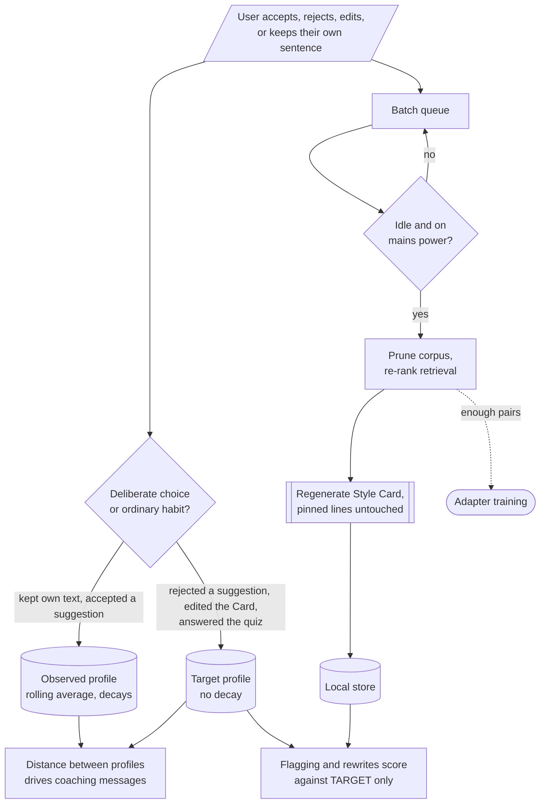
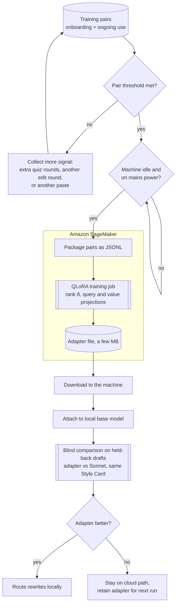

# Writing Assistant

A Windows writing assistant that checks spelling, grammar, and style as you type, across the browser, Microsoft Word, and native desktop apps.

You declare the voice you want during onboarding. The assistant then flags sentences that drift from it, rewrites passages into it, and underlines the phrasing habits that make prose read as LLM-generated.

> **Status:** early development. No released build yet.

## How it works



Detail on the two boxes above: [onboarding](#onboarding) and [the Style Card](#the-style-card).

### Vocabulary

| Term | Meaning |
|---|---|
| **Style Card** | Plain-English rules describing the target voice. Produced by onboarding, editable any time, conditions every rewrite |
| **Target voice** | The way the user says they want to write. Held numerically as the target profile and in words as the Style Card |
| **Target profile** | Numeric vector of the target voice. Changes only on users' deliberate changes |
| **Observed profile** | Numeric vector of how the user writes today. Measured, decays over time |
| **Drift** | Distance between a sentence and the target profile. |
| **AI tells** | Catalogued phrasings that mark text as model-written |

### Latency tiers

Work is assigned to a tier by how fast it has to answer, and stays there.

| Tier | Trigger | Budget | Work |
|---|---|---|---|
| **0** | Every keystroke | < 50 ms | Spelling, deterministic grammar, drift from the target profile, AI tells |
| **0.5** | 500 ms after typing stops | 200 to 300 ms | Full [LanguageTool](https://languagetool.org) rule set on changed sentences |
| **1** | On request | Seconds | Rewrite plus two-stage critic. The only tier that calls a cloud model |

## Core features

| Feature | Detail |
|---|---|
| Two capture surfaces | Browser extension and UI Automation client, all behind one interface |
| Declared target voice | Flagging scores against the voice the user chose, kept separate from measured habit |
| Live style flagging | Per-sentence drift at Tier 0. Each flag names the target it missed and by how much |
| Editable Style Card | Any line editable, pinned lines survive regeneration, every rewrite traces back to a rule |
| Grammar and spelling | [hunspell](https://github.com/hunspell/hunspell) at Tier 0, LanguageTool at Tier 0.5, both set to Singapore English |
| AI-tell detection | Deterministic matching against a vendored pattern catalog |
| Rewrites attached to flags | Flagged spans carry replacement wording in the card. Manual selection covers anything unflagged |
| Grounded rewrites | Style Card plus retrieved passages of the user's own writing condition each rewrite, checked against the Card before display |
| Form modes and register | Prose, Fragments, or Off, detected from structure. Formality inferred per document |
| Local and inspectable | Corpus, profiles, Style Card, and adapters are files the user can open, edit, or delete |
| Bounded learning | Rolling averages, capped corpus, batch work on idle AC power |

### Language convention

Singapore English, which follows British spelling and grammar with local vocabulary on top.

| Layer | Setting |
|---|---|
| hunspell | `en_GB` in its `-ise` form rather than Oxford `-ize`, since Singapore usage is "organise" and "realise". A supplementary word list covers local terms, and the user dictionary sits on top of both |
| LanguageTool | The `en-GB` variant, which changes grammar rules and not only spelling: plural agreement on collective nouns, and punctuation outside quotation marks unless it belongs to the quote |
| Style engine | Spelling convention is a Style Card rule, so a draft mixing conventions flags as drift instead of passing silently |

Neither project ships an `en_SG` dictionary, so `en_GB` is the base and the Singapore supplement is a plain word list that grows without touching the engine.

## User Onboarding

Three phases. Each phase produces data used by a different part of the running product.

| Phase | What the user does | Format | Produces |
|---|---|---|---|
| **1. Preference quiz** | Answers ~30 short rounds about how they want to write | ~25 A/B choices between two sentences differing on one trait, plus ~5 sliders for traits that are continuous rather than binary | Target profile v1 |
| **2. Paste past writing** | Pastes 2,000 to 5,000 words of their own writing they are happy with | One plain-text box | Observed profile v1, exemplar corpus |
| **3. Edit loop** | Edits a generated paragraph until it sounds right, up to 4 rounds | Free-text editing of a short sample paragraph written in the target voice | Style Card, edit pairs |

### Phase 1: preference quiz

Two question formats, chosen per trait.

| Format | Used for | Example |
|---|---|---|
| A/B choice | Traits with a clear either/or reading: contractions, hedging, passive voice, list versus prose, jargon tolerance | "Two sentences, same meaning. Which reads better?" |
| Slider | Traits that are a dial rather than a switch: average sentence length, formality, technical density, directness | "How long should a typical sentence run?" with live example text updating as the slider moves |

Answers set the **target profile** directly. Nothing here is measured from the user's writing, which is the point: the quiz runs before the paste so the stated aspiration is fixed before the user re-reads their own habits.

### Phase 2: paste past writing

One text box. The paste does two separate jobs.

| Output | Built by | Later used for |
|---|---|---|
| Observed profile | Measuring the same 50 to 200 features that Tier 0 computes live | Coaching messages that report the gap between habit and target |
| Exemplar corpus | Splitting the text into passages of roughly 60 words | Retrieval that grounds every rewrite in real sentences the user wrote, and raw material for adapter training pairs |

### Phase 3: edit loop

The system writes a short paragraph in the target voice, using the quiz answers, the measured habits, and retrieved passages from the corpus. The user edits it. The system rewrites from the edits and tries again. The loop ends when edits stop shrinking, or after four rounds.

The final agreed paragraph is turned into the **Style Card**, and every round of edits is kept as a training pair.



### The Style Card

The Style Card is the target voice written as ordinary rules a person can read and disagree with, for example "sentences average around 14 words", "no hedging verbs", "contractions are fine". It is the one artifact the user edits directly.

| Role | Where it is used |
|---|---|
| Conditions rewrites | Sent with every Tier 1 prompt, alongside retrieved examples |
| Backs the hard critic | Rules stated as counts are checked deterministically before a rewrite is shown |
| Defines what "generic" means | Drives the de-styling step that manufactures adapter training pairs |
| Explains a flag | A style underline cites the Card line it missed |

Lines the user pins survive regeneration when the Card is rewritten from newer data.

### What each artifact is used for

| Artifact | Written by | Read by |
|---|---|---|
| Target profile | Quiz answers, Style Card edits, rejected suggestions | Tier 0 drift flagging, rewrite prompts |
| Observed profile | Accepted suggestions, sentences the user keeps | Coaching messages only, never flagging |
| Style Card | Phase 3, then batch regeneration | Rewrite prompt, hard critic, flag explanations |
| Exemplar corpus | Phase 2 paste, then ongoing writing | Retrieval for rewrites, source text for training pairs |
| Training pairs | De-styling the corpus, user edits, accepted rewrites | Voice adapter training |

## Architecture

Three invariants shape everything below.

| Invariant | Reason |
|---|---|
| Live checking is arithmetic and rules only | A network round trip costs 500 ms or more |
| Adapters carry voice, facts come from the draft and retrieved context | Adapters encode style faithfully and invent details confidently |
| Only deliberate acts move the target profile | Measured behavior updates the observed profile, so habit never drags the target back |



### While the user types



Style flags are suppressed on spans that already carry a hard grammar error. Losing LanguageTool degrades the pipeline to spelling plus style flags.

### When a rewrite is requested



The critic is split because the halves need different machinery. Rules the Style Card states as counts are checked by counting, which is instant and produces an explanation the user can argue with. Judging whether a draft reads right needs a frontier-class model.

### How the style model learns



Passive behavior is evidence about where somebody currently writes. Only deliberate acts are evidence about where they want to write.

## Personalization

Two paths, live at the same time and directly comparable.

| | Path A: prompt conditioning | Path B: voice adapter |
|---|---|---|
| Model | [Claude Sonnet 5](https://docs.claude.com/en/api/overview) | Qwen3 8B, quantized |
| Mechanism | Style Card plus 3 retrieved examples in the prompt | [QLoRA](https://arxiv.org/abs/2305.14314), rank 8, query and value projections |
| Available | Day one, from one writing sample | Once enough training pairs exist |
| Trains | Not applicable | [Amazon SageMaker](https://aws.amazon.com/sagemaker/) training job |
| Runs | Anthropic API | Locally, via [llama.cpp](https://github.com/ggml-org/llama.cpp) or [ONNX Runtime](https://onnxruntime.ai) |

The base model is pinned to an open-weight instruct model small enough to run on a desktop and cheap enough to fine-tune, and is swappable as better candidates appear.

### Training data

The adapter learns one direction: generic prose in, target voice out. Training consumes **pairs**, and every pair is (input draft, target-voice output).

| Source | How a pair is made | Volume |
|---|---|---|
| Exemplar corpus | Each passage is rewritten into flat generic prose three times, with the Style Card defining exactly which stylistic traits to strip. Each generic variant becomes an input, and the user's original passage is the target output | 3 pairs per passage. A 3,000-word paste yields roughly 50 passages, so roughly 150 pairs on day one |
| Onboarding edits | The generated paragraph is the input, the user's edited version is the target | A handful, weighted highest because the user chose the wording |
| Ongoing use | Every rewrite the user accepts or edits pairs with the draft it replaced | Grows continuously, so the pair count is not fixed at onboarding |

Three de-styled variants per passage is deliberate: several different flat inputs mapping to one target voice is the signal a style adapter needs to generalize.

### Training pipeline



Falling short of the threshold prompts the user for more signal rather than silently waiting. Only the idle and power check is a wait, and it gates when the job runs, not whether there is enough data.

Both paths staying live is what makes the comparison honest: same drafts, same Style Card, one variable.

## Repository structure

```
writing-assistant/
├── src-tauri/                    # Rust core
│   ├── src/
│   │   ├── capture/              # Capture trait, native UIA backend, insertion cascade
│   │   ├── languagetool/         # Subprocess lifecycle, HTTP client
│   │   ├── style/                # Features, profiles, form modes, telltales, flags
│   │   ├── store/                # Corpus index, Style Card, config
│   │   ├── rewrite/              # Orchestrator, Anthropic client, critic
│   │   ├── analyzer.rs           # Merge, dedupe, rank
│   │   └── learning.rs           # Signal logging, batch scheduler
│   └── resources/
│       ├── languagetool-server.jar
│       └── ai-telltales/         # Vendored catalog, CC BY-SA, kept separate
├── src/                          # React + TypeScript frontend
│   └── components/               # Overlay, Style Card editor, onboarding, settings, tray
├── extension/                    # Browser extension, web capture backend
└── adapter/                      # Pair synthesis, QLoRA training job
```

The style and checking engine is a library crate with a clean public API, so it can later fold into a larger desktop assistant as one crate among several.

## Components

| Component | Responsibility |
|---|---|
| Capture interface | One contract for text delivery, cursor reporting, and replacement. The engine never learns which backend served a request |
| Web backend | Reads and writes in the DOM, covering browser-based editors with real DOM text content. Canvas-rendered editors defeat this read; see the native backend row and Capture interface's own module documentation for which of those are covered another way |
| Native backend | Focus and text-change subscriptions, sentence expansion, cursor rectangle for overlay placement. Also the path for Microsoft Word's desktop document surface and, it turns out, Word for the web's, both exposing UI Automation's `TextPattern` like any other rich-text control. Google Docs' canvas-rendered surface needs its own screen reader support and braille support turned on, in Google Docs' own accessibility settings, before this backend can read it the same way; see the Capture interface's own module documentation for what was verified |
| Insertion cascade | Writes corrections into native apps, degrading per application through value-set, synthetic input, then clipboard paste |
| Analyzer pipeline | Debounce, incremental diffing, merge and dedupe by span, ranking, LRU cache |
| Grammar engine | Tier 0.5 rule set, subprocess lifecycle, health checks, bounded restart |
| Style engine | Feature extraction, portability weighting, drift flags, AI-telltale matching, form-mode detection |
| Register inference | Document context to formality, audience, and purpose. One cached call per document |
| Store | Profiles, exemplar corpus, Style Card, training pairs, adapters, config |
| Rewrite orchestrator | Router, retriever, writer, two-stage critic, onboarding loop |
| Adapter pipeline | Pair collection, synthetic pair generation, QLoRA training, versioning, hot-swap |
| Learning scheduler | Signal logging, rolling-average updates, corpus pruning, Style Card regeneration |
| Shell and UI | Overlay, tray, settings, Style Card editor, onboarding flow, register indicator |
| Distribution | Signed installers, verified auto-update, accessibility-permission flow, API key entry |

## Tech Stack

| Layer | Technologies |
|---|---|
| Core | [Rust](https://www.rust-lang.org), [Tokio](https://tokio.rs), [Rayon](https://github.com/rayon-rs/rayon), [`parking_lot`](https://github.com/Amanieu/parking_lot) `FairMutex` for deterministic real-time latency |
| Capture | [`windows-rs`](https://github.com/microsoft/windows-rs) with [UI Automation](https://learn.microsoft.com/en-us/windows/win32/winauto/entry-uiauto-win32) `TextPattern`, [Extension MV3](https://developer.chrome.com/docs/extensions/mv3/intro/) |
| Analysis | [`similar`](https://crates.io/crates/similar), [`ropey`](https://crates.io/crates/ropey), [`regex`](https://crates.io/crates/regex), [`unicode-segmentation`](https://crates.io/crates/unicode-segmentation), hunspell with `en_GB` plus a Singapore supplement, LanguageTool 6.x set to `en-GB` over localhost HTTP |
| Style features | 50 to 200 deterministic features across function words, punctuation, orthography, sentence shape, and readability, plus the AI-telltale catalog |
| Models | Claude Sonnet 5 for rewrites, soft critic, onboarding generation, and de-styling. Encoder classifier with a regression head for register. Quantized Qwen3 8B plus QLoRA for the local adapter |
| Runtimes | Java 17+ via `jlink` for LanguageTool, ONNX Runtime, llama.cpp |
| Data | SQLite via [`rusqlite`](https://github.com/rusqlite/rusqlite), flat vector index, Markdown Style Card, JSON config via [`directories`](https://crates.io/crates/directories) |
| Desktop and UI | [Tauri 2.x](https://tauri.app) with a frameless transparent always-on-top overlay, [React](https://react.dev) 19, TypeScript, [Zustand](https://github.com/pmndrs/zustand), [Vite](https://vitejs.dev) |
| Infrastructure | Anthropic API, Amazon SageMaker, [WiX](https://wixtoolset.org) MSI, [NSIS](https://nsis.sourceforge.io) for ARM64, EV code signing, [WebView2](https://developer.microsoft.com/en-us/microsoft-edge/webview2/) `embedBootstrapper`, Tauri updater |
| Observability | [`log`](https://crates.io/crates/log) and `env_logger`, in-app log viewer, continuous Tier 0 latency tracking |

The AI-telltale catalog is vendored from [signs-of-ai-writing](https://github.com/egc365/signs-of-ai-writing), which ships machine-readable JSON and YAML for 30+ patterns. It stays a separate data file, kept out of source.

## Requirements

| | Minimum |
|---|---|
| OS | Windows 10 22H2 or Windows 11, x64 |
| RAM | 8 GB, or 32 GB to run a voice adapter locally |
| Disk | ~500 MB, or ~4 GB with a local model and adapter |
| Runtime | Bundled `jlink` Java runtime |
| Network | Required for rewrites. Live checking works offline |
| Credentials | Anthropic API key on first run. AWS with SageMaker access only to train a voice adapter |
| Optional | A Chromium-based browser for the web surface |

Offline, the app still captures text and runs spelling, grammar, drift, and AI-tell flagging locally. Rewriting and the soft critic need the cloud until an adapter is trained, after which they run locally too.

## License

This project is [MIT licensed](LICENSE).

Bundled and vendored components keep their own licenses. The two that carry live obligations are isolated by design: LanguageTool runs as a separate subprocess rather than a linked library, and the telltale catalog ships as an attributed data file rather than merged into source.

| Component | License | Notes |
|---|---|---|
| [LanguageTool](https://github.com/languagetool-org/languagetool) 6.x | LGPL-2.1-or-later | Bundled JAR, invoked as a subprocess over localhost |
| [signs-of-ai-writing](https://github.com/egc365/signs-of-ai-writing) catalog | CC BY-SA, tooling MIT | Pattern observations derive from Wikipedia. Attributed, and modifications stay under the same license |
| [hunspell](https://github.com/hunspell/hunspell) | MPL-1.1 / GPL-2.0 / LGPL-2.1 | Engine only |
| `en_GB` dictionary | Varies by source | Licensed separately from the engine. The LibreOffice British dictionary is LGPL-3.0, while SCOWL-derived builds are permissive. Confirm at selection time |
| OpenJDK runtime via `jlink` | GPL-2.0 with Classpath Exception | The exception is what permits bundling |
| [Qwen3 8B](https://huggingface.co/Qwen) | Apache-2.0 | Fine-tuning and shipping a per-user adapter is permitted |
| Tauri, Rust crates | MIT / Apache-2.0 | Notice only |
| [WiX Toolset](https://wixtoolset.org) v3 | MS-RL | Build-time only |
| [NSIS](https://nsis.sourceforge.io) | zlib/libpng | Build-time only |

Full license texts ship as `THIRD-PARTY-NOTICES.md` in release builds.
